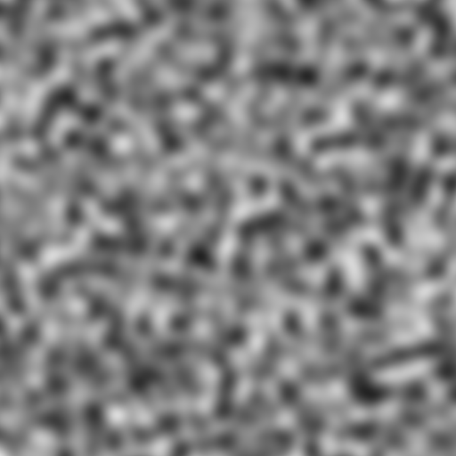

# Open Simplex Noise
[](https://travis-ci.org/doughsay/crystal-open-simplex-noise)

This is an implementation of 2D, 3D, and 4D open simplex noise in crystal.

## Installation

Add this to your application's `shard.yml`:

```yml
dependencies:
  open-simplex-noise:
    github: doughsay/crystal-open-simplex-noise
    version: "~> 1.0"
  ...
```

## Usage

```crystal
require "open-simplex-noise"
```

Instantiate a noise generator using an `Int64` seed:

```crystal
noise = OpenSimplexNoise.new(12345_i64)
```

Use the `generate` method, passing in either 2, 3, or 4 `Float64`s to generate noise:

```crystal
noise.generate(1.0, 2.0)
#=> -0.08284024020120388
```

## Examples

2D Noise:


3D Noise (2D slice):


4D Noise (2D slice):



## Contributing

1. Fork it ( https://github.com/doughsay/open-simplex-noise/fork )
2. Create your feature branch (git checkout -b my-new-feature)
3. Commit your changes (git commit -am 'Add some feature')
4. Push to the branch (git push origin my-new-feature)
5. Create a new Pull Request

## Contributors

- [doughsay](https://github.com/doughsay) Chris Dosé - creator, maintainer

## Credits

This is mostly just a transliteration of the python version from here: https://github.com/lmas/opensimplex, which itself is a transliteration of Kurt Spencer's original code (released to the public domain).

## License

[MIT](LICENSE.md)
